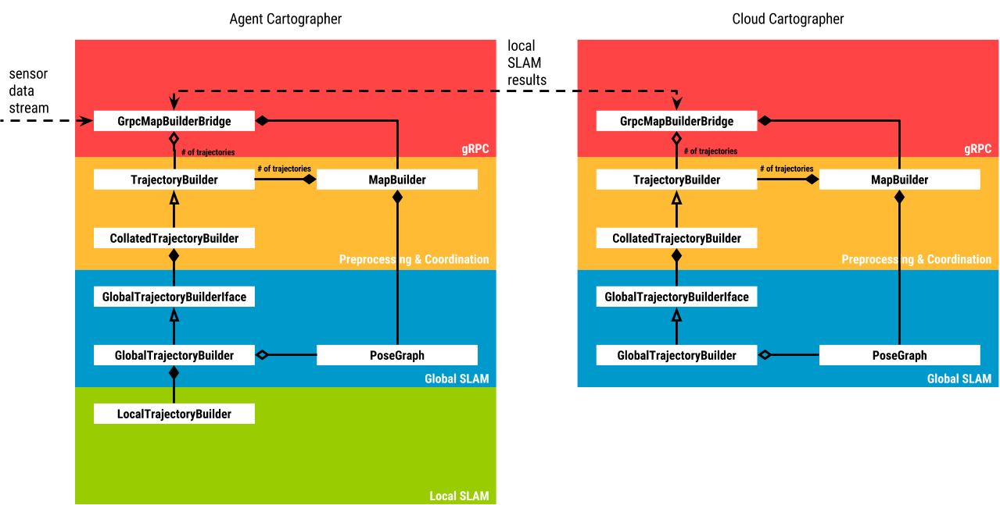

# Cloud-Based Mapping: Upstreaming Local SLAM Results

## Summary
[summary]: #summary

The goal of this RFC is to describe an approach to build out the Cartographer system into a collaborative, cloud based mapping solution, i.e. we want to support a fleet of mapping agents running Cartographer in pure localization mode against a map while forwarding the required information to formulate the global SLAM problem in the cloud.
A central cloud instance receives local SLAM results and assembles them into a global map of the environment combining information across time and agents.
By fanning out global map updates to agents, individual agents can benefit from world observations made by other agents with the cloud acting as an arbiter.
Note that the approach for distributing global SLAM results from the central intance to mapping agents is not described in this RFC and will be covered by a follow-up.

## Motivation
[motivation]: #motivation

In many robotics applications multiple robots simultaneously map and localize within a continuously changing environment.

Forwarding local SLAM results from agents to a central instance and solving the global SLAM problem in the cloud has the following advantages

- by involving multiple robots sharing information (e.g. sensor measurements or intermediate mapping results) among one another, local world observations can be combined into a global and more detailed map of the world and the mapping process expedited.
- by moving some of the computational load of mapping away from battery-powered agents to a central cloud instance with virtually unbounded computational resources, the mapping performance and runtime of agents can be enhanced with reduced hardware requirements.

## Approach
[approach]: #approach

In the rest of this RFC we refer to the Cartographer instance running in the cloud as *Cloud Cartographer* and the instances running on the agents as *Agent Cartographer*.
With the cloud only solving the global SLAM problem and the agents running in *pure localization mode*, we know that

- *Cloud Cartographer* does not require a `LocalTrajectoryBuilder` as there is no local SLAM problem to be solved.
- *Agent Cartographer* needs to upload all necessary information for *Cloud Cartographer* to formulate the global SLAM problem *and* also route that information to its local version of the global optimization problem that is reduced to the pure localization case.

### Software Components Overview

While implementing this RFC we want to keep the following three types of Cartographer users happy

- Users that link against libcartographer as a C++ library and don’t care about ROS at all
- ROS users that use the ROS binaries *cartographer_offline_node* and *cartographer_node* to stream sensor data as ROS messages and receive Cartographer’s SLAM results as ROS messages
- Users that want to use cloud-based mapping, might use ROS or not to send sensor data into the system and are happy to embrace gRPC as an IPC system both on the robot and between robot and cloud.

To make sure all three groups of users are comfortable with the plans laid out in this RFC we have decided to

- continue our efforts to push for a stable public libcartographer C++ interface.
- keep *cartographer_offline_node* and *cartographer_node* free of gRPC serialization/deserialization.
- introduce new gRPC-dependent binaries in the cartographer and cartographer_ros repo that form the basis of cloud-based mapping.
- hide any dependency on gRPC behind a compilation flag.

#### cartographer_node_grpc and cartographer_offline_node_grpc

In the *cartographer_ros* repository we will add two new binaries, *cartographer_node_grpc* and *cartographer_offline_node_grpc*.
These binaries will contain the same ROS specific code (e.g. `Node`) that *cartographer_node* and *cartographer_offline_node* contain, e.g. they take care of all the TF logic, but perform gRPC calls against the *cartographer_grpc* binary (see below) for everything that was formerly passed through C++ function invocations against `MapBuilderBridge` and `SensorBridge`.

This will require us to

- extract interfaces out of `MapBuilderBridge` and `SensorBridge`.
- implement a gRPC bridging version of the above two classes that serialize any sensor data to proto3 and send that to a gRPC service.

In principle once we have a binary that does ROS to gRPC translation it would be possible to replace the existing cartographer ROS node with a combination of this translation binary and *cartographer_grpc*, i.e. instead of the C++ interface between *cartographer_node* and libcartographer that exists today we would introduce a local, loopback gRPC layer.
We have decided not to go this route and keep the current *cartographer_node* as is until we have a better idea of the performance impact (or benefit) of this additional gRPC serialization / deserialization and whether adding gRPC to our dependencies is acceptable for our ROS users.

#### cartographer_grpc

We introduce a new binary,  *cartographer_grpc*, in the *cartographer* repo, which offers the cartographer gRPC service - essentially a gRPC representation of the `MapBuilder` interface. 
This binary runs both on agent and cloud albeit with different runtime configuration.
Depending on its configuration it acts both as gRPC server and client. It can be configured to

- run as a standalone SLAM solution that receives sensor data as gRPC messages and publishes SLAM results as gRPC messages.
This is essentially a thin wrapper around the C++ API of libcartographer.
- run as a purely localizing instance that receives sensor data as gRPC messages, publishes the robot pose as gRPC messages and upstreams local SLAM results to the cloud as gRPC messages.
- offers a gRPC service that accepts local SLAM results and only solves the global SLAM problem, offering the SLAM solution as gRPC messages.

Upon installation *cartographer_grpc* installs the generated gRPC service headers for e.g. binaries in cartographer_ros.

| name                             | repo             | dependencies      |
| -------------------------------- | ---------------- | ----------------- | 
| libcartographer                  | cartographer     | proto3            |
| cartographer_grpc                | cartographer     | proto3, gRPC      |
| cartographer_(offline)_node      | cartographer_ros | proto3, ROS       |
| cartographer_(offline)_node_grpc | cartographer_ros | proto3, gRPC, ROS |

### Detailed Design

#### cartographer_grpc

The important interaction between local and global SLAM happens through `GlobalTrajectoryBuilder` between `LocalTrajectoryBuilder` and `PoseGraph`. 

The following component diagram describes the cloud mapping architecture

On the agent side, a `GrpcMapBuilderBridge`is responsible for forwarding all information necessary for the formulation of the global SLAM problem in the cloud.
This also includes the `LocalTrajectoryBuilder::InsertionResult`.

Forwarding IMU, odometry and fixed frame data is straightforward:
*sensor.proto* already contains proto messages for these data types (currently used only for file (de)serialization) and, as these flow through the `MapBuilderBridge` anyways, it is simple to forward them.

To get access to the `LocalTrajectoryBuilder::InsertionResult`  the `GrpcMapBuilderBridge` will register a `LocalSlamResultCallback` with the `GlobalTrajectoryBuilder`.
 
In order to properly sync submaps to the cloud, the `GrpcMapBuilderBridge` needs to be able to detect two types events:

1. A new Submap has been created in `LocalTrajectoryBuilder`, that the `PoseGraph` does not yet know about.
2. An existing Submap has been finished.

i) can be detected by `GrpcMapBuilderBridge` remembering the last submap it has seen as `insertion_result.back()`.
Whenever that changes between invocations of `AddRangeFinderData()`, a new submap has been added.
`GrpcMapBuilderBridge` then sends up the `local_pose` of the new submap to the cloud.

ii) can be detected by `GrpcMapBuilderBridge` observing `insertion_submaps.front().finished()`.
Whenever that returns true (which is only once throughout the lifetime of any one `Submap`) the submap’s `Probability-` or `HybridGrid` is serialized and uploaded to the cloud.

The `CollatedTrajectoryBuilder` feeds sensor data into the `GlobalTrajectoryBuilder` in a strict time order.
This order needs to be maintained per sensor when sensor data is forwarded to the cloud.
A simple way to achieve this is to use a streaming gRPC connection, which ensures that “each side will always get the other’s messages in the order they were written” [quote](http://wildebeestdev.github.io/grpc.github.io/docs/tutorials/basic/c.html#implementing-routeguide).
We choose to forward the sensor data in a streaming fashion rather than batching them up into a state that includes the finished submap for two reasons

1. gRPC prefers small message sizes.
   Streaming does its best to ensure that.
   In this RFC we ignore the intermittent connection dropouts that are likely to happen in real systems and address them in a later RFC.
2. Continuously sending up sensor information distributes the computational load in the cloud better as it allows to search for INTER_SUBMAP constraints against scans that belong to yet unfinished submaps.

#### Visualization of SLAM results

Here we outline how rviz can visualize intermediate SLAM results when cartographer_grpc is used.

In addition to the gRPC methods that are needed to push sensor data and local SLAM results into *cartographer_grpc*, *cartographer_grpc* will offer all the necessary gRPC methods to allow the *cartographer_node_grpc* and *cartographer_node_offline_grpc* to back the topics and ROS services that *rviz* relies on for visualization.

As an example, submap visualization will work as follows

1. *cartographer_node_grpc* timer indicates that it is time to publish the submap list.
2. *cartographer_node_grpc* will call `cartographer_grpc::GetSubmapList()` to retrieve the current submap list as a proto message.
3. *cartographer_node_grpc* will deserialize the proto message, serialize to a ROS `::cartographer_ros_msgs::SubmapList` message publish that on the ROS `submap_list` topic.
4. rviz receives the message for the subscribed `submap_list` topic and hand it to the Cartographer rviz plugin for visualization.
5. The Cartographer rviz plugin parses the message and realizes that it does not yet have a graphical representation of e.g. the latest submap from the list.
6. The rviz plugin calls out to the ROS `submap_query` service offered by *cartographer_node_grpc* to retrieve the data for the submap.
7. *cartographer_node_grpc* calls the `GetSubmapData()` gRPC method in *cartographer_grpc* to retrieve the submap data as a proto.
8. *cartographer_node_grpc* deserializes the proto message, and repackages it as a ROS `SubmapTexture` message to send to rviz.

## Discussion Points
[discussion]: #discussion

*What about scaling?
Cloud cartographer can't solve significantly larger problems than we currently solve on the robots without some changes.*

This RFC only addresses the problem of distributing load between cloud and agent.
Life-long mapping which aims to make the optimization problem feasible when robots continuously move in a constrained area for an arbitrary long time and some from of sharding in real space for huge mapping problems are deliberately not addressed by this RFC.
These developments are also largely orthogonal to cloud-based mapping.
