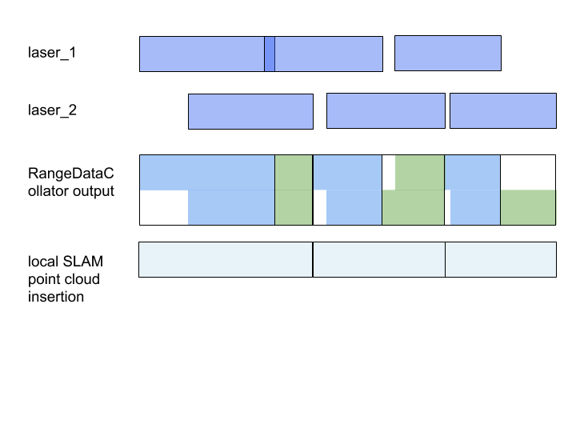

# Synchronize range data points

## Summary
[summary]: #summary

Synchronize individual points from multiple range sensors to support multi-sensor per-point unwarping.

## Motivation
[motivation]: #motivation

Per-point unwarping was introduced in https://github.com/googlecartographer/cartographer/pull/636, but it cannot be used for multiple sensors because `PoseExtrapolator` requires non-overlapping point times https://github.com/googlecartographer/cartographer/issues/910.

## Approach
[approach]: #approach

`LocalTrajectoryBuilder` needs to use non-overlapping time-sorted points and needs to know the origin from where there measurement was taken to perform unwarping and submap insertion.
We introduce a new `RangeDataCollator` that knows the expected range sensor ids and synchronizes range data into matching chunks.
Inside chunks, points are sorted by time, and refer to the origin from where they were acquired.
Each chunk ends when a range data message ends.
Chunks are output as a new struct `TimedPointCloudOriginData`.
(This is different from `Collator`, which does not modify data.)
`RangeDataCollator` is a member of `LocalTrajectoryBuilder`.

Behavior:

A work-in-progress implementation is given in https://github.com/googlecartographer/cartographer/pull/961.

## Discussion Points
[discussion]: #discussion

