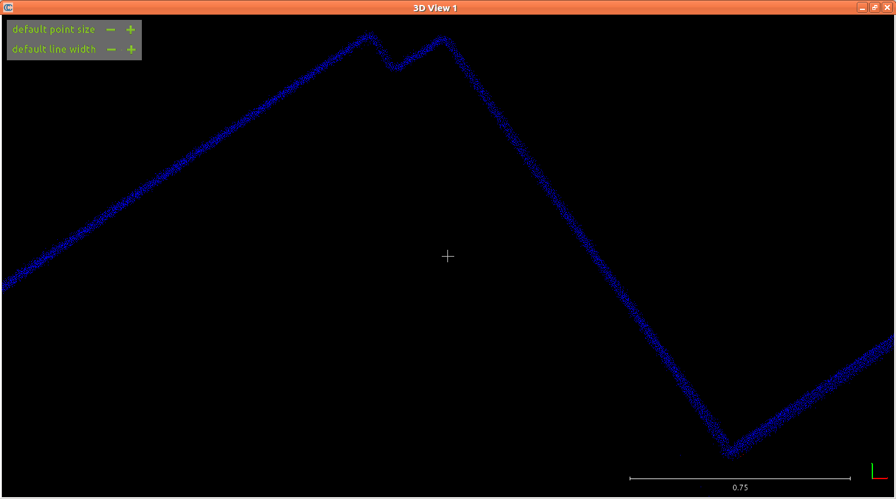

# Reconsider the role of odometry in the 2D optimization problem

## Summary
[summary]: #summary

An odometry term has been added to the optimization problem in [this pull request](https://github.com/googlecartographer/cartographer/pull/456).
The term is used if odometry data is available and acts as a relative pose constraint that penalizes deviations from the relative odometry measurements during the optimization.
If no odometry data is available, the relative pose constraint is formed in the conventional way from consecutive initial pose estimates.

Since this approach seems to be problematic in some cases where odometry data is available (e.g. [here](https://github.com/googlecartographer/cartographer/issues/534), our own experiments), we should reconsider the *implicit* use of odometry-based constraints in the optimization.

## Motivation
[motivation]: #motivation

* Odometry-based constraints imply a certain level of trust in the overall quality of the raw odometry measurements.
This could be problematic due to the sometimes unreliable measurements of (wheel) odometry, as it can be drifting due to wheel slip or miscalibration.
* Initial pose estimation in the front-end combines different sensor modalities (pose extrapolation, scan matching) - in contrast, adding a pure odometry constraint in the back-end does not account for multiple sensors and may introduce a bias.

## Approach
[approach]: #approach

The proposed approaches are:

1. ~~Revert the changes introduced by the PR mentioned above if the discussion yields that the odometry constraint is *generally* not beneficial.~~

2. ~~A simple compromise would be to introduce a boolean option that allows to use the initial pose estimates for the relative constraints instead of the odometry even if odometry data is available (as it was before the change).~~

3. ***Use both the local slam result as well as the wheel odometry, each weighted by a individual set of translational and rotational weight parameter.***
This way everyone could tune cartographer to his setup.

4. ~~Use the pose extrapolator result instead of pure odometry to form the constraint.~~
~~The extrapolator is fusing IMU and odometry *complementary*, i.e. the gyroscope data for rotation extrapolation and the odometry for translation extrapolation.~~

<details>
<summary>Changelog - click to expand</summary>
We rejected 1. because we can't assume that odometry is never beneficial in global constraints.

We implemented 2. for testing and saw a qualitative improvement with our system.
We observed slight rotational drift in our wheel odometry, which explains the inferior performance if the odometry constraint is used.
This approach comes with the cost of introducing a new configuration parameter.

In case a new parameter should be added, we agreed that it makes more sense to go with approach 3. as it offers more flexibility.

We implemented 4. for testing and saw no qualitative improvement with our system.
Especially due to the noisy nature of gyroscope data, the pose extrapolator is not a very precise source for global constraints.
However, as a source for an initial guess before scan matching (as it is already used) slight noise is not as problematic as in the global optimization.
</details>

## Example for the Effect of Separate Constraints (proposal #4)

We investigated a section of the `hallway_localization.bag` repository in which errors can be observed in the raw pointcloud (exported with the assets writer).
The mapping was run with the default parameters of the `cartographer_magazino` repository, i.e. with optimization enabled.

The following two pictures show the top view of the pointclouds generated with the current optimization approach and a prototype of the proposed separate constraints approach.
The shown area is a flat wall, which means that the standard deviation of the scan points from the wall should be low around the true wall surface (no "double walls").
Therefore, a thin distribution of points is an indicator for high quality pose estimates.

Current upstream, i.e. implicit odometry-based constraints:


Proposed explicit, separate weighting:


The only parameters added for the new approach were:
```lua
POSE_GRAPH.optimization_problem.initial_pose_translation_weight = 1e5
POSE_GRAPH.optimization_problem.initial_pose_rotation_weight = 1e5
POSE_GRAPH.optimization_problem.odometry_translation_weight = 1e5
POSE_GRAPH.optimization_problem.odometry_rotation_weight = 1e1
```

The new parameterization gives the flexibility to down-weight the rotation of the  wheel odometry (which we don't trust too much), while still benefiting from the strong rotation estimates of local slam and the high-resolution translation of the wheel odometry.

Test integration & data: [cartographer_magazino](https://github.com/magazino/cartographer_magazino)


## Discussion Points
[discussion]: #discussion

1. A discussion about the pro's and con's of the current implementation would be good since there might be different views due to different experiences with this topic.

2. Because of 1., the possible approaches are of course also up to discussion and more suggestions are welcome.

3. If we decide for approach 3., we need to decide on meaningful default parameters.
