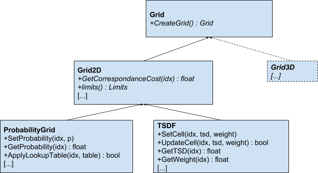
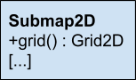

# Generalize Probability Grid and Submap2D Structure
## Summary
[summary]: #summary

We propose to introduce a generalized structure of the `ProbabilityGrid` and `Submap2D` to allow the use of alternative grid data representations such as signed distance fields or adding intensities to submaps.
`ProbabilityGrid` will be generalized to serve as an interface for scan matching and constraint detection, allowing to use the same scan matcher and constraint detector with different map representations.

## Motivation
[motivation]: #motivation

A generalized map interface allows the exploration of alternative map representations, such as Truncated Signed Distance Fields (e.g. [Kinect Fusion](https://www.microsoft.com/en-us/research/wp-content/uploads/2016/02/ismar2011.pdf)), Euclidean Signed Distance Fields (e.g. [Voxblox](https://arxiv.org/pdf/1611.03631.pdf)) or adding intensities to submaps.
Signed Distance Field approaches provide a straightforward extraction of iso-surfaces (eg. as surface mesh).
First experiments indicate potential benefits in terms of accuracy of the pose, fidelity of the map and efficiency (see [2D-SDF-SLAM](https://www.researchgate.net/profile/Joscha-David_Fossel/publication/308298063_2D-SDF-SLAM_A_signed_distance_function_based_SLAM_frontend_for_laser_scanners/links/58e66d1fa6fdcc6800b47916/2D-SDF-SLAM-A-signed-distance-function-based-SLAM-frontend-for-laser-scanners.pdf)).

## Approach
[approach]: #approach

We propose to introduce a common grid interface `Grid` providing a factory method to generate a new grid.
`Grid` will be the base class for `Grid2D` which will serve as common interface for 2D grids.
`Grid2D` maintains the map limits, the update indices and exposes the function `GetCorrespondenceCost` which computes a cost based on the matching of a range observation at a given position with the map.
`GetCorrespondenceCost` is used for scan matching and constraint detection instead of `GetProbability`.
For the `ProbabilityGrid`, application of the `CorrespondenceCostFunction` yields an equivalent formulation of the underlying optimization problem as before.
Therefore, no change in performance of the `ProbabilityGrid` is expected.
Furthermore, `Grid2D` exposes functions the get the minimum and maximum possible correspondence cost which are required for the constraint detection. 

Furthermore, `Submap2D` will expose the `Grid2D` type instead of `ProbabilityGrid`.

## Discussion Points
[discussion]: #discussion

How about 3D?
The structure of the 3D pipeline is similar to the 2D pipeline.
Therefore, we are planning to generalize the 3D pipeline similarly after the 2D pipeline is finished.
